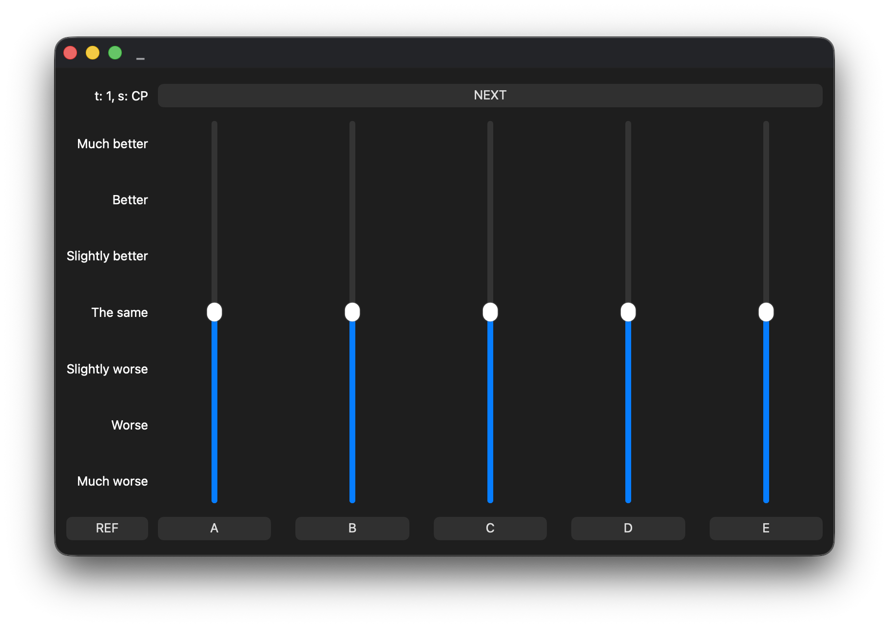
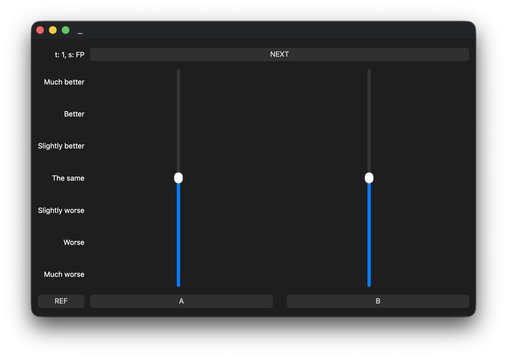

# AP Research Audio Form

Recreating the form that was used in [this](https://aes.org/publications/elibrary-page/?id=16480) study from AES

Created with the closest behaviour to the form as possible, only filling the blanks when needing to.

This used to be a very in-depth github repo, but I wasn't pushing any changes to github, and after a while I realized that I had been including the lossless wav files in my commits, and it was increasing my file size by a lot, so I had to reset this repo a few times.

## Behaviour

The UI pools the audio that it needs to use from the instance1.json file under res, (will be soon expanded to different instances for a more diverse range of music)

There two trials (or songs) that the listener will rate, each trial has two steps:
* **Coarse Personalization Test**: Four versions of the songs modified with EQ curves that hold a dynamic range of 9db will be presented, and the listener will rate them based off of a ITU-R BS 1284 scale.
* **Fine Personalization Test**: The highest rated EQ curve gets determined, and listener is shown that, and another curve with a dynamic range of 4.5db

This occurs twice, and then data is dumped under the data folder as res.json

## Photos

*Trial One Coarse Personalization*

*Trial Two Fine Personalization*

This repeats and then the data is dumped to be used later :)